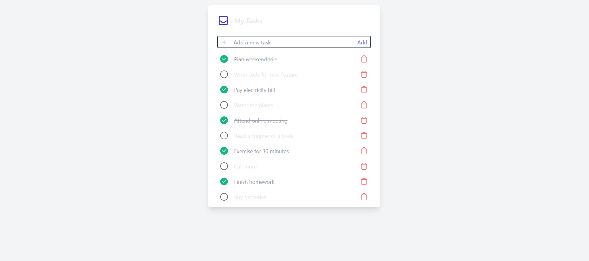
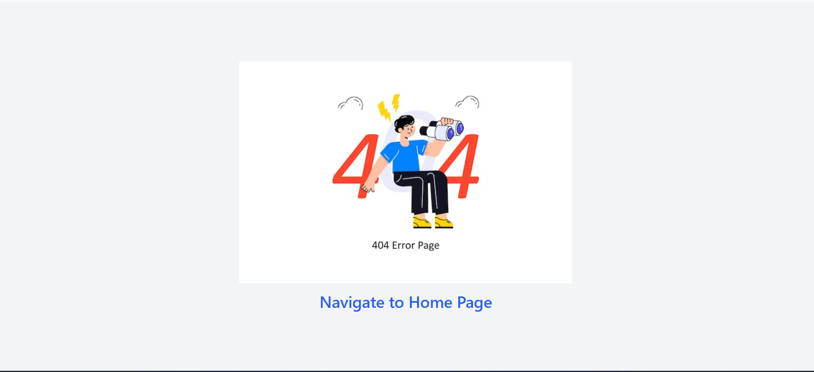

# Todo App

This is a simple Todo application built with React.js and uses a JSON web server as a backend.

## Features

- Add new tasks
- Mark tasks as completed
- Update tasks
- Delete tasks
- Data persistence using a JSON web server

## Prerequisites

Before running the application, make sure you have the following installed:

- Node.js
- npm or yarn
- JSON Server (for running the backend)

## Getting Started

1. Clone this repository:

   ```bash
   git clone https://github.com/abhishekkumar085/Todo-App.git

    cd todo-app
    npm install
    #Start the JSON server for the backend:
    npm run json-server
    #Start the React app:
    npm run dev
   ```

2. Project Structure

   ```
    todo-app/
    ├── public/                 # Static assets and HTML template
    ├── src/                    # React source code
    │   ├── components/         # Reusable components
    │   ├── App.js              # Main component
    │   ├── index.js            # Entry point
    ├── db.json                 # JSON database for the web server
    ├── package.json            # Project metadata and dependencies
    └── README.md
   ```

## Technologies Used

- React js
- Json Server

## Licence
- This project is licensed under the MIT License - see the LICENSE file for details.
## Image

